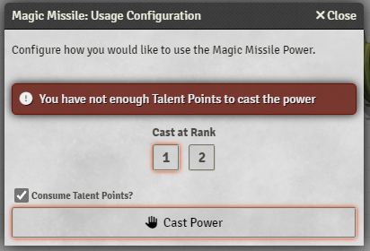

# Foundry VTT - Esper Genesis Addon for 5e

An implementation of Esper Genesis basic rules on top of the [dnd5e system](https://github.com/foundryvtt/dnd5e) and [Tidy5e Sheet](https://github.com/sdenec/tidy5e-sheet).
There are no classes or content, so you need to add them individually.

## How to Use

-   [New Sheet Design](#new-sheet-design)
-   [Talents vs Techniques](#talents-vs-techniques)
-   [New Skills +](#new-skills-)

### New Sheet Design

### Talents vs Techniques

Talents use _Talent Points_ and Techniques uses _Power Rank Slots_. When using a power the system keeps track of the resources used.

### New Skills +

Several updates to the 5e system:

-   Updated skill list
-   Disciplines
-   Power Ranks
-   And more...

## License

This work is licensed under Foundry Virtual Tabletop EULA - Limited License Agreement for Package Development - Version 11.293.
